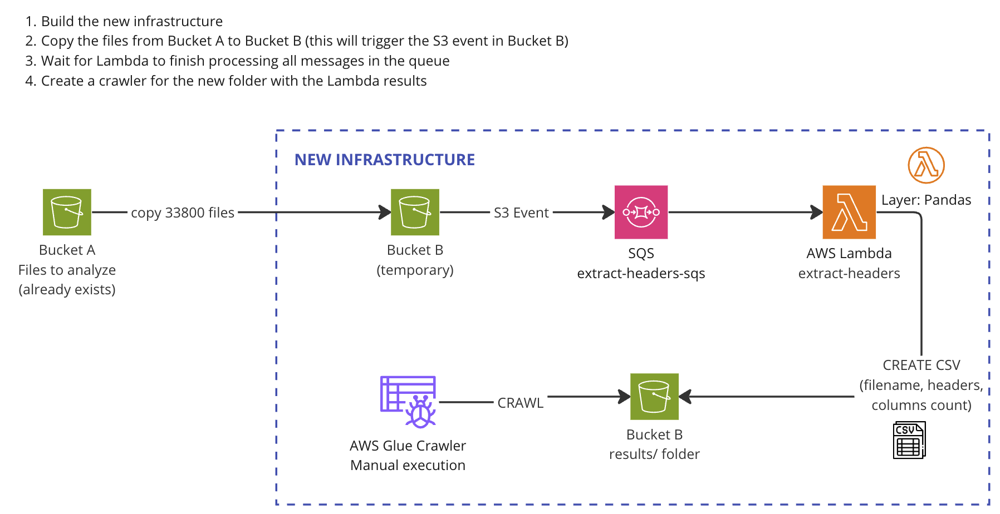

# Script to help figure out why Glue is choosing to create 1 table per file instead of 1 table for the entire folder
* Written in Python 3.10
* Depends on Pandas
* Inputs: SQS message generated by an S3 event (contains bucket and key of the file to analyze)

## Inputs

* Message from SQS

## Requirements
* Python 3.10+
* Pandas as a Lambda layer
* Role that allows Lambda to interact with the SQS queue, read from the S3 bucket that generated the S3 event and SQS message, and write into the destination
* If running this in AWS Lambda: a timeout of at least 5 min

## Architecture
